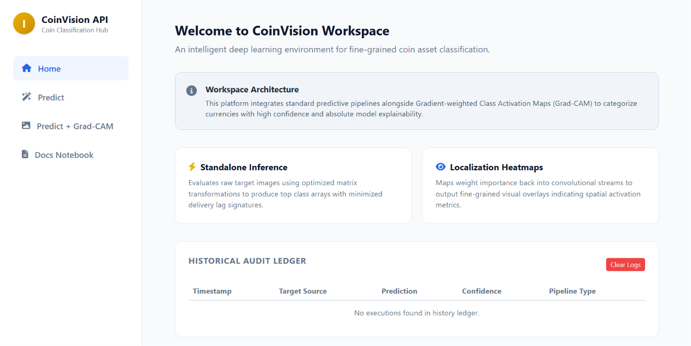
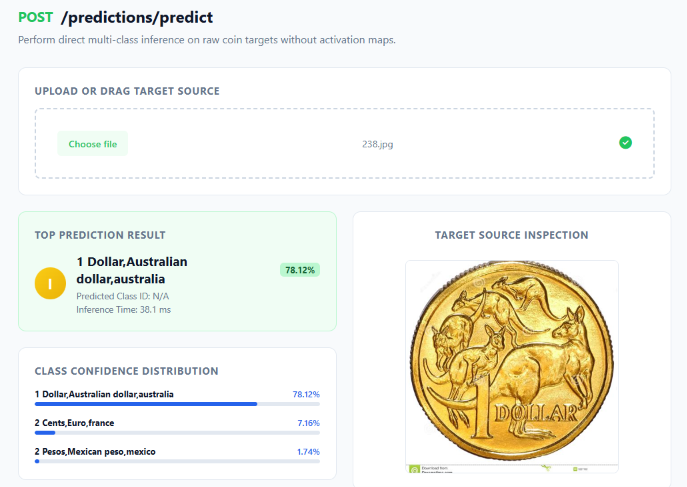
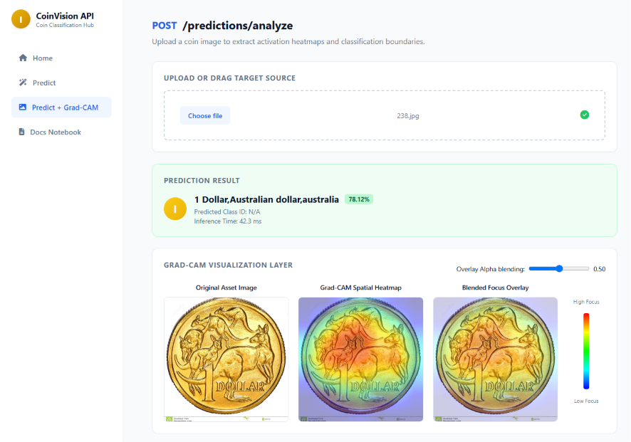
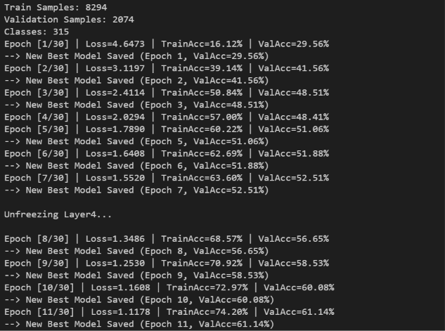
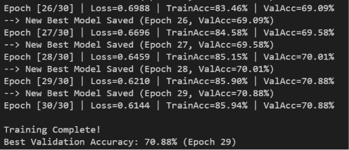
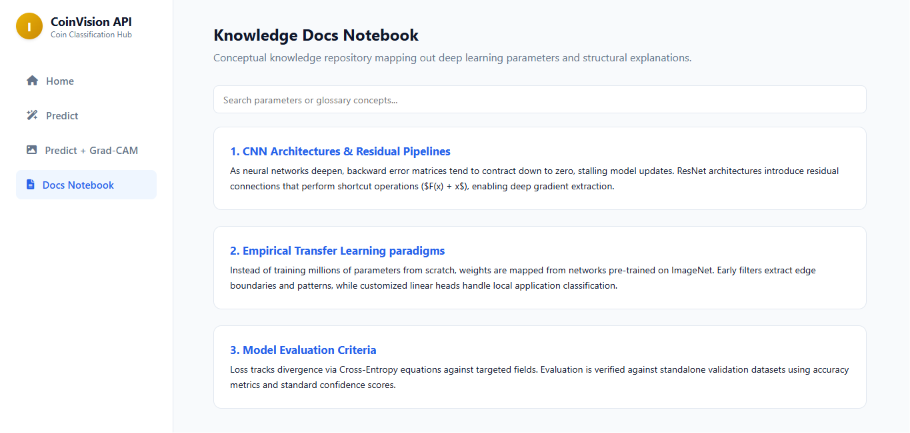

# 🪙 CoinVision

CoinVision is a Transfer Learning-powered coin classification platform that identifies coins from around the world using a fine-tuned ResNet18 model and provides visual explanations through Grad-CAM.

The project combines Computer Vision, Explainable AI, FastAPI, SQLAlchemy, and a web-based interface into a complete end-to-end machine learning application.

---

## 🚀 Features

* 🌍 Multi-class coin classification across **315+ coin categories**
* 🧠 Transfer Learning using a fine-tuned ResNet18 model
* 🔥 Grad-CAM Explainable AI visualizations
* 🎯 Top-3 prediction support with confidence scores
* ⚡ FastAPI REST API backend
* 🗄️ SQLAlchemy + SQLite prediction history storage
* 🖼️ Interactive web interface for image uploads
* 📊 Validation-based model checkpointing and training pipeline

---

# 📸 Application Preview

## Home Dashboard

The main interface for uploading images and interacting with the system.



---

## Coin Classification

Predict a coin's denomination and country using the trained model.



---

## Explainable AI with Grad-CAM

Visualize which regions of the image influenced the model's prediction.



---

## Training Progress

Multi-phase fine-tuning strategy used during training.



---

## Best Validation Checkpoint

Model performance tracking and checkpoint selection.



---

## Development Notebook

Experimentation and model development workflow.



---

# 🏗️ System Architecture

```text
User Upload
     │
     ▼
 FastAPI Backend
     │
     ▼
 ResNet18 Model
     │
     ├── Prediction
     ├── Top-3 Predictions
     └── Grad-CAM Heatmap
     │
     ▼
 Frontend Visualization
```

---

# 🤖 Machine Learning Pipeline

## Dataset

* ~10,000 coin images
* 315+ unique classes
* Stratified train-validation split
* Data augmentation:

  * Random Crop
  * Horizontal Flip
  * Rotation
  * Color Jitter

## Model

* Backbone: ResNet18
* Pretrained on ImageNet
* Transfer Learning
* Multi-phase fine-tuning

### Phase 1

Train only the classification head.

### Phase 2

Unfreeze Layer4 and continue fine-tuning with a smaller learning rate.

---

# 🔥 Explainable AI

CoinVision integrates Grad-CAM (Gradient-weighted Class Activation Mapping) to make model predictions interpretable.

Rather than acting as a black box, the model highlights the regions of the coin image that contributed most to the final prediction.

This allows users to understand why a prediction was made and verify whether the model is focusing on meaningful visual features.

---

# 🛠️ Tech Stack

## Machine Learning

* PyTorch
* Torchvision
* Scikit-Learn

## Backend

* FastAPI
* SQLAlchemy
* SQLite

## Frontend

* HTML
* CSS
* JavaScript

---

# 📂 Project Structure

```text
CoinVision/
│
├── app/
│   ├── database/
│   ├── models/
│   ├── routers/
│   ├── schemas/
│   └── services/
│
├── ml/
│   ├── dataset.py
│   ├── train.py
│   ├── inference.py
│   ├── evaluate.py
│   └── gradcam.py
│
├── frontend/
│
├── trained_models/
│
├── screenshots/
│
├── requirements.txt
└── README.md
```

---

# ⚙️ Installation

Clone the repository:

```bash
git clone https://github.com/ritviktabishala/CoinVision.git
cd CoinVision
```

Install dependencies:

```bash
pip install -r requirements.txt
```

Run the FastAPI server:

```bash
uvicorn app.main:app --reload
```

Open:

```text
http://127.0.0.1:8000/docs
```

to access the interactive API documentation.

---

# 🎯 Project Highlights

* Built an end-to-end machine learning application from training to deployment-ready API design.
* Implemented Transfer Learning and staged fine-tuning for large-scale coin classification.
* Integrated Explainable AI using Grad-CAM.
* Designed a modular FastAPI backend following service-based architecture.
* Added prediction history tracking using SQLAlchemy and SQLite.

---

# 🚀 Future Improvements

* Cloud deployment
* User authentication
* Analytics dashboard
* Additional currency support
* Model versioning and experiment tracking
* Mobile-friendly UI

---

# 👨‍💻 Author

**Ritvik Rohan Reddy**

B.Tech, IIT Hyderabad

Interested in Backend Engineering, Machine Learning, and Systems Design.
